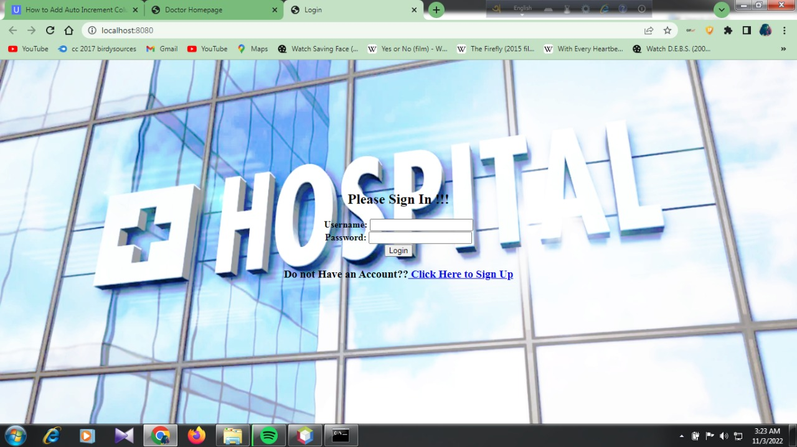
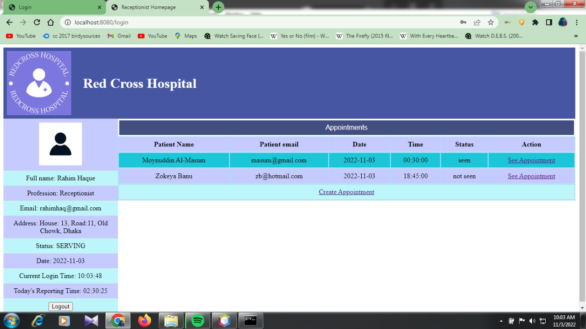
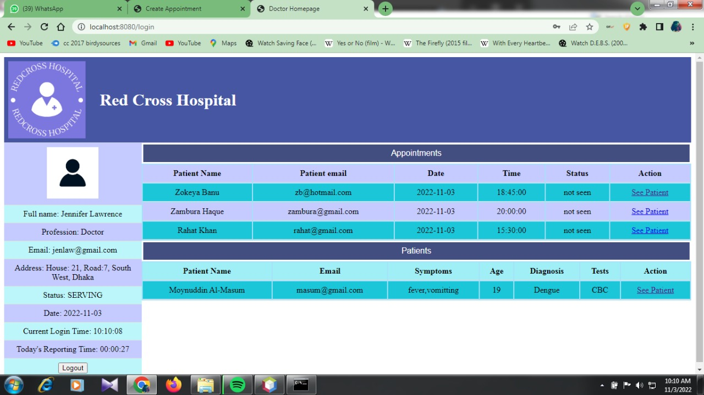
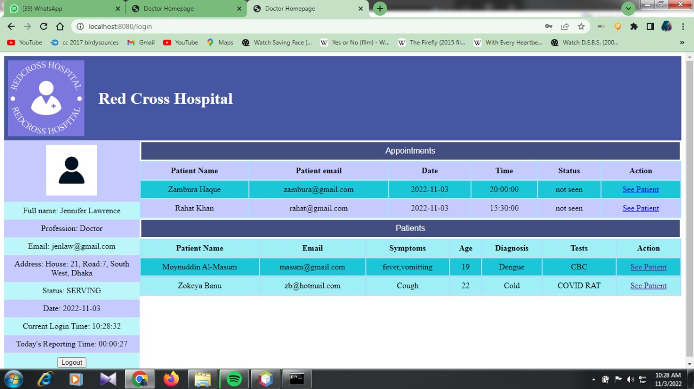
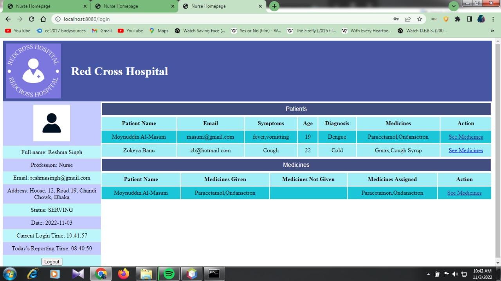
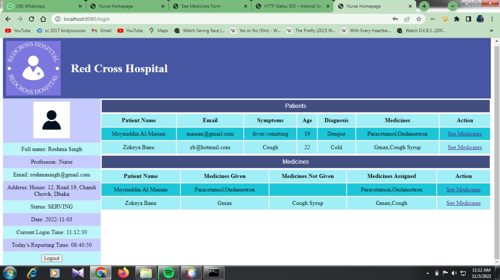
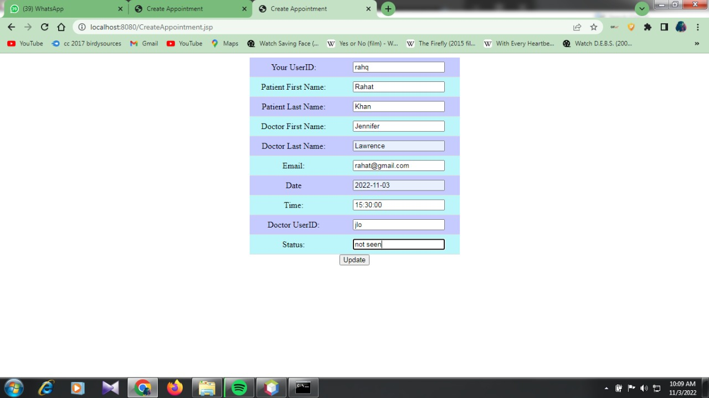

# Hospital Management System
Welcome to Hospital Management System Web Project developed using Java. The main motive behind the development of this project was to learn the basics of Java Servelet and JDBMS connectiviy.
## Overview
#### Login Page

#### Registration Page

#### Home Page
Receptionist Home Page

Doctor Home Page

Nurse Home Page

#### Creating Appointment

